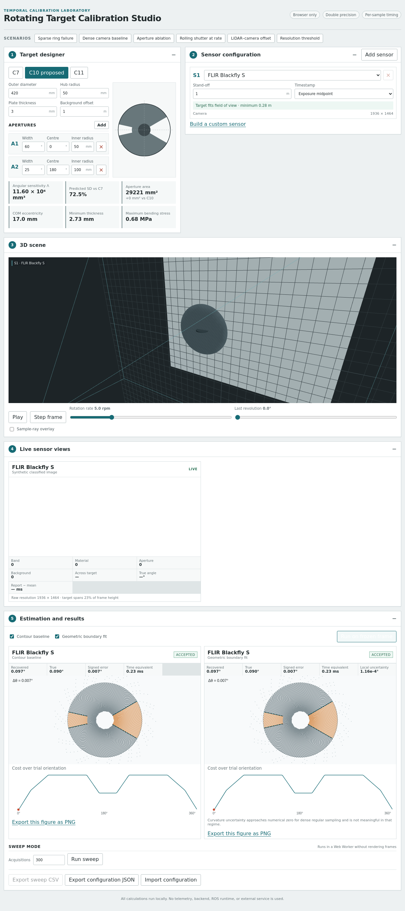

# Rotating Target Calibration Studio

An interactive, browser-only laboratory for studying temporal calibration with a rotating apertured disc and heterogeneous LiDAR/camera sampling. It combines exact ray–plane intersection, true per-sample observation times, selectable reported-timestamp conventions, a contour baseline and a global geometric boundary fit.

**[Open the live application](https://maninka123.github.io/rotating-target-calibration-studio/)**



## Quick start

Requires Node.js 20.19+ or 22+.

```bash
npm ci
npm run dev
```

Open the local URL printed by Vite. Everything runs in the browser; there is no backend, ROS runtime, Python service, telemetry or external API.

Validate a production build:

```bash
npm run typecheck
npm run lint
npm test
npm run build
npm run preview
```

## What is included

- Live C7/C10/C11 target editing with sensitivity, removed area, centre-of-mass and plate checks.
- Six shared sensor architectures and sixteen built-ins.
- One to three sensors with independent stand-off and timestamp conventions.
- A Three.js scene with true aperture holes, sensor frustums, orbit controls and optional rays.
- Typed-array sample frames generated and estimated in a Web Worker.
- Frozen-frame contour and geometric estimation with publication-style overlays and cost curves.
- Batch sweeps, error statistics, signed-error plots, cross-sensor time-offset recovery and CSV export.
- Configuration JSON import/export and a persistent custom sensor builder.
- Six one-click teaching/validation scenarios.

## Adding a custom sensor

Open **Panel 2 — Sensor configuration**, select **Build a custom sensor**, choose one of the six architecture templates, enter its FOV, stand-off and nominal acquisition density, then save it. Validation runs before saving. Custom definitions use the same `SensorDefinition` schema and code path as built-ins and persist in browser `localStorage`.

For source-controlled sensors, add a JSON-serialisable object to `src/sensors/library.ts`. Architecture-specific optional fields are defined in `src/core/types.ts`.

## Implemented physics

For each sample ray, the target-plane intersection is evaluated analytically in double precision. Radius and polar angle determine material/aperture/background class at that sample’s own observation time. The background plane is visualised behind true through-holes. Only the annulus from hub radius to outer radius enters estimation.

Angular sensitivity is

```text
Λ = Σ 2(R³ − ρₖ³) / 3
```

where each annular-sector aperture contributes two radial boundaries. Predicted dispersion follows `SD ∝ Λ⁻¹ᐟ²`.

Sector area is `α(R² − ρ²)/2`. Removed-sector centroid radius is

```text
r̄ = (2/3) (R³ − ρ³)/(R² − ρ²) · sin(α/2)/(α/2)
```

and remaining-plate eccentricity follows from removed-area moments. Plate checks use aluminium density 2700 kg/m³, `E = 70 GPa`, gravity 9.81 m/s² and a 0.05 mm deflection limit.

The proposed estimator performs a global 0–360° class-agreement search, applies a clipped boundary tolerance, then refines the best interval by golden-section search.

## Licence

MIT — see [LICENSE](LICENSE).
