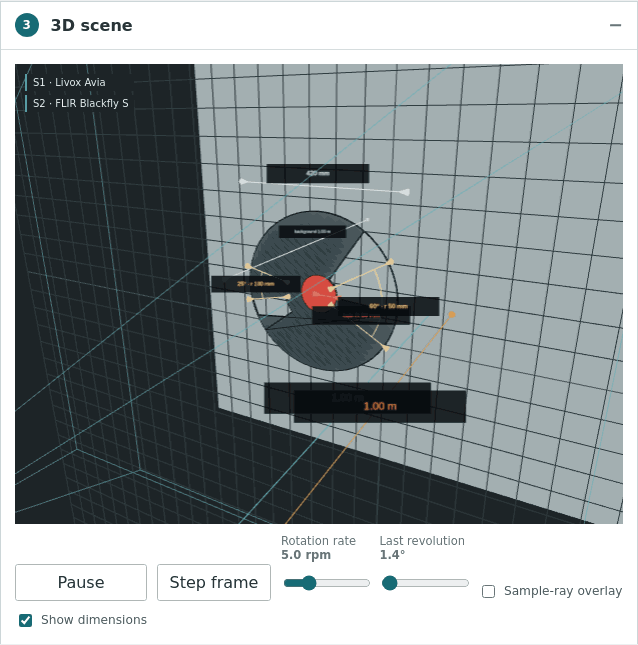
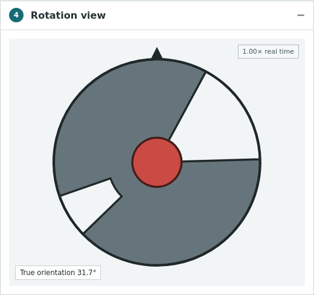
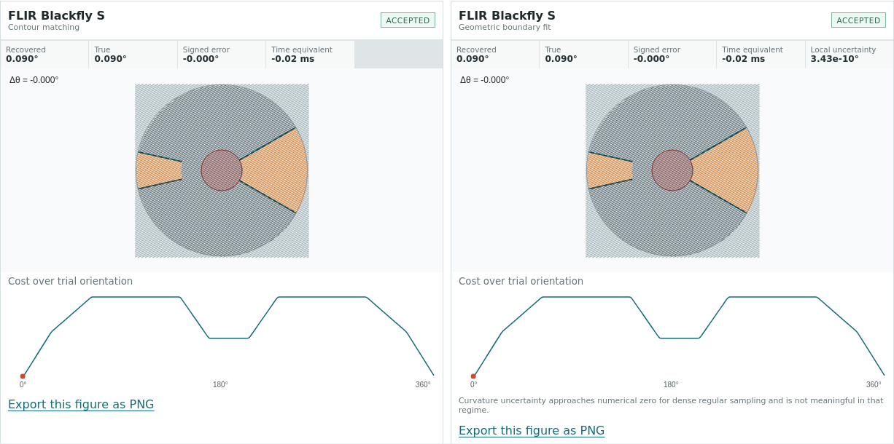
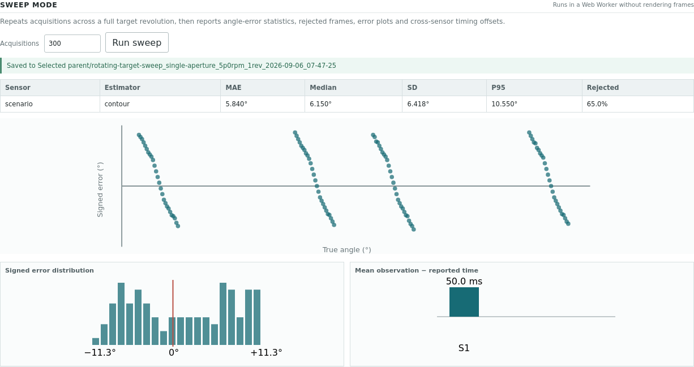

# Rotating Target Calibration Studio

An interactive, browser-only laboratory for studying temporal calibration with a rotating apertured disc and heterogeneous LiDAR/camera sampling. It combines exact ray–plane intersection, true per-sample observation times, selectable reported-timestamp conventions, a contour matching and a global geometric boundary fit.

## Scope

A standalone browser tool for exploring rotating-target geometry and
angle estimation. The scene is noise-free: no range noise, classification
error, boundary blur or radiometric effects. Accuracy shown here is an
optimistic bound, not measured hardware performance.

**[Open the live application](https://maninka123.github.io/rotating-target-calibration-studio/)**



## Quick start

Requires Node.js 20.19+ or 22+.

```bash
npm ci
npm run dev
```

Open the local URL printed by Vite. Everything runs in the browser; there is no backend, ROS runtime, Python service, telemetry or external API.

Validate a production build:

```bash
npm run typecheck
npm run lint
npm test
npm run build
npm run preview
```

## What is included

- Live single-, dual- and triple-aperture target editing with sensitivity, removed area, centre-of-mass and plate checks.
- Seven shared sensor architectures and seventeen built-ins.
- One to three sensors with independent stand-off and timestamp conventions.
- A Three.js scene with rim-connected through-holes, adjustable translucent sensor fields of view, distance annotations, orbit controls and optional rays.
- Typed-array sample frames generated and estimated in a Web Worker.
- Frozen-frame contour and geometric estimation grouped once per sensor, with thick actual/recovered templates, angle-error tables and cost curves.
- Batch sweeps, error statistics, signed-error plots, cross-sensor time-offset recovery and CSV export.
- Configuration JSON import/export and a persistent custom sensor builder.
- Six one-click teaching and validation scenarios.

Sweep mode repeats the selected sensor acquisitions across one full target revolution without animating every frame. It summarises angle accuracy, estimator rejections and relative timing offsets, making systematic behaviour easier to see than in a single paused frame.



## Preset scenarios

- **Sparse ring failure:** demonstrates contour rejection on four scan rings.
- **Dense camera:** compares both estimators on global-shutter imagery.
- **Aperture ablation:** explores the single-, dual- and triple-aperture sensitivity progression.
- **Rolling shutter at rate:** contrasts global and sequential row exposure at speed.
- **LiDAR–camera offset:** recovers the configured accumulation-to-exposure time offset.
- **Resolution threshold:** downsamples camera geometry toward estimator rejection.

## Adding a custom sensor

Open **Panel 2 — Sensor configuration**, select **Build a custom sensor**, choose an architecture, enter its FOV, stand-off and scan parameters, then save it. The preview generates the resulting rays and reports the counted band samples before saving. Custom definitions use the same `SensorDefinition` schema and code path as built-ins and persist in browser `localStorage`.

For source-controlled sensors, add a JSON-serialisable object to `src/sensors/library.ts`. Architecture-specific optional fields are defined in `src/core/types.ts`.

## Implemented physics

For each sample ray, the target-plane intersection is evaluated analytically in double precision. Radius and polar angle determine material/aperture/background class at that sample’s own observation time. The background plane is visualised behind true through-holes. Only the annulus from hub radius to outer radius enters estimation.

Angular sensitivity is

```text
Λ = Σ 2(R³ − ρₖ³) / 3
```

where each annular-sector aperture contributes two radial boundaries. Angular dispersion scales as `SD ∝ Λ⁻¹ᐟ²`.

Sector area is `α(R² − ρ²)/2`. Removed-sector centroid radius is

```text
r̄ = (2/3) (R³ − ρ³)/(R² − ρ²) · sin(α/2)/(α/2)
```

and remaining-plate eccentricity follows from removed-area moments. Plate checks use aluminium density 2700 kg/m³, `E = 70 GPa`, gravity 9.81 m/s² and a 0.05 mm deflection limit.

The geometric boundary-fit estimator performs a configurable-resolution global 0–360° class-agreement search, applies a clipped boundary tolerance, then refines the best interval by golden-section search. The default coarse search step is 1°.



Sweep results collect the accuracy and rejection behaviour across a complete revolution.



## Licence

MIT — see [LICENSE](LICENSE).
