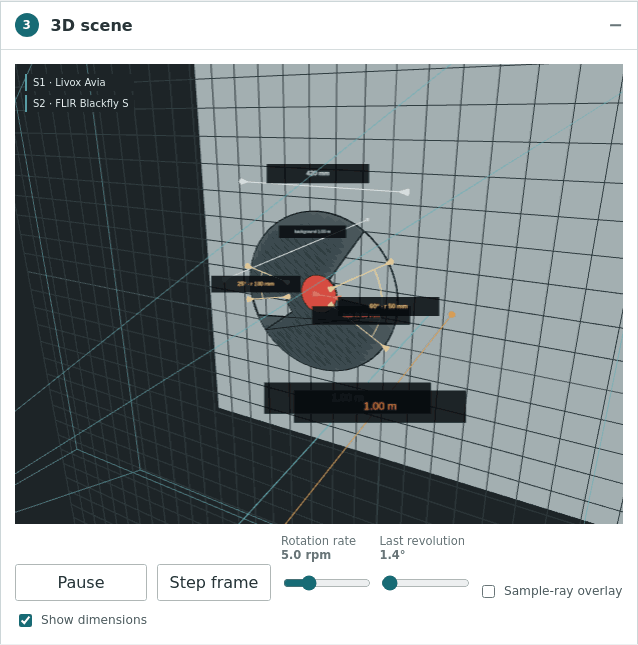
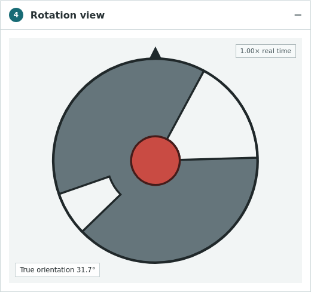
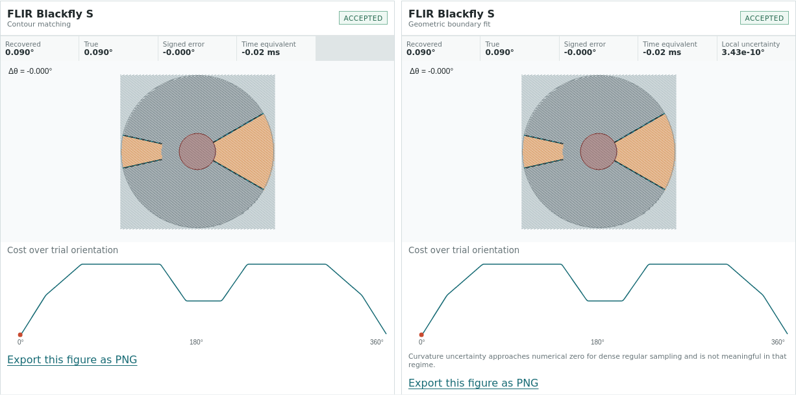
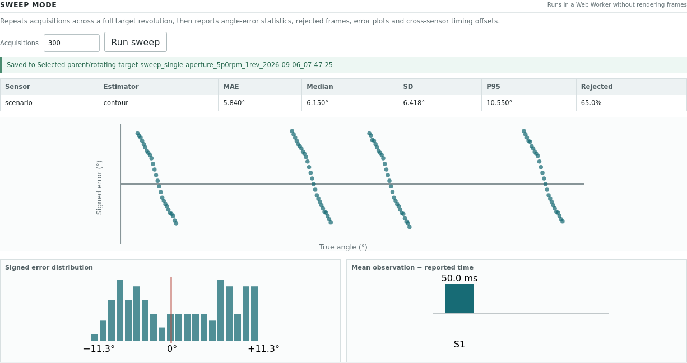

# Rotating Target Calibration Studio

Explore how different LiDAR and camera architectures recover the
orientation of a rotating apertured disc, and how their timestamping
conventions shift the recovered time.

**[▶ Open the live application](https://maninka123.github.io/rotating-target-calibration-studio/)**



## Scope

A standalone browser tool for exploring rotating-target geometry and
angle estimation. The scene is noise-free: no range noise,
classification error, boundary blur or radiometric effects. Accuracy
shown here is an optimistic bound, not measured hardware performance.

## What you can do

- **Design a target** — set the diameter, hub and apertures, and watch
  angular sensitivity, removed area, eccentricity and plate stress
  update live.
- **Place sensors** — seventeen built-in models across seven
  architectures, or build your own.
- **Watch it turn** — 0 to 20 rpm, with each sensor's view updating in
  real time.
- **Estimate** — pause and run two estimators on the same frame, with
  overlays and cost curves.
- **Sweep** — batch runs over one or more revolutions, with error
  statistics and cross-sensor offset recovery.

## Sensor architectures

Each generates rays from its own scan kinematics, not a stored density.

| Architecture | Scan behaviour | Built-in models |
|---|---|---|
| Rotating multi-channel | Fixed-height rings from enumerated channels and azimuth steps | 6 |
| Counter-rotating prism | Acquisition-dependent rosette, non-repeating | 3 |
| Oscillating micro-mirror | Sinusoidal horizontal, ramped vertical — eye-shaped | 1 |
| Rotating mirror | Asymmetric −7° to +52° elevation, optional pitch | 1 |
| Solid-state array | Fixed rectangular angular grid | 1 |
| Single-plane scanner | Zero-elevation fan | 1 |
| Camera | Rectangular grid from resolution, pitch and focal length | 4 |



## Start here

Six one-click scenarios, each set up to show one effect:

| Scenario | Shows |
|---|---|
| Sparse ring failure | Contour matching rejecting a four-channel scan |
| Dense camera | Both estimators on global-shutter imagery |
| Aperture ablation | Sensitivity across one, two and three apertures |
| Rolling shutter at rate | Global versus sequential row exposure |
| LiDAR–camera offset | Recovering an accumulation-to-exposure lag |
| Resolution threshold | Where angular recovery stops working |



## Run locally

Requires Node.js 20.19+ or 22+.

```bash
npm ci
npm run dev
```

Everything runs in the browser. No backend, no ROS runtime, no external
API.

## How it works

Each sample ray is intersected analytically with the target plane in
double precision, and classified as material, aperture or background at
that sample's own observation time. Only the annulus between the hub
and outer radius enters estimation.

Angular sensitivity is

```text
Λ = Σ 2(R³ − ρₖ³) / 3
```

summed over radial aperture boundaries, and angular dispersion scales
as Λ⁻¹ᐟ².

Full detail on the sensor models, timestamp conventions, estimators and
sweep behaviour is in [docs/physics.md](docs/physics.md).



## License

MIT — see [LICENSE](LICENSE).

## Citation

If you use **Rotating Target Calibration Studio** in academic research, publications, theses, or reports, please cite the associated preprint.

### Associated preprint

Ranasinghe, P., Patra, D., Banerjee, B. P., & Raval, S. (2026).
*A Rotating Aperture Target with a Common Geometric Estimator for Temporal Calibration of Heterogeneous Sensors*.
SSRN preprint. [Read the preprint](https://papers.ssrn.com/sol3/papers.cfm?abstract_id=7513129).
DOI: [10.2139/ssrn.7513129](https://doi.org/10.2139/ssrn.7513129).

```bibtex
@misc{ranasinghe2026rotatingaperture,
  author = {Ranasinghe, Pasindu and Patra, Dibyayan and Banerjee, Bikram Pratap and Raval, Simit},
  title = {A Rotating Aperture Target with a Common Geometric Estimator for Temporal Calibration of Heterogeneous Sensors},
  year = {2026},
  doi = {10.2139/ssrn.7513129},
  url = {https://papers.ssrn.com/sol3/papers.cfm?abstract_id=7513129},
  note = {SSRN preprint}
}
```

See [CITATION.cff](CITATION.cff) for the preferred preprint citation used by GitHub's **Cite this repository** feature.
